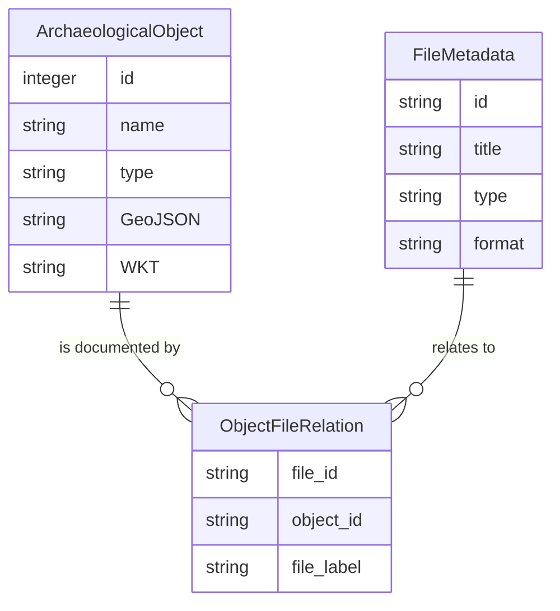

# DeVill Metadata

Metadata dataset of the project ["The Digital Deserted Medieval Villages Archive" (DeVill)](https://devill.oegmn.or.at)
by the Austrian Society for Medieval and Modern Archaeology (ÖGMN).

## Table of Contents

- [Overview](#overview)
  - [Context](#context)
  - [Spatial Coverage](#spatial-coverage)
  - [Temporal Coverage](#temporal-coverage)
- [How to Cite](#how-to-cite)
- [Dataset Description](#dataset-description)
  - [1. Archaeological Objects](#1-archaeological-objects)
    - [CSV Structure (Archaeological Objects)](#csv-structure-archaeological-objects)
    - [Machine Readable Formats (Archaeological Objects)](#machine-readable-formats-archaeological-objects)
      - [Ontologies & Namespaces](#ontologies--namespaces)
      - [Controlled Vocabularies](#controlled-vocabularies)
  - [2. File Metadata](#2-file-metadata)
    - [CSV Structure (File Metadata)](#csv-structure-file-metadata)
    - [Machine Readable Formats (File Metadata)](#machine-readable-formats-file-metadata)
  - [3. Object-File Relations](#3-object-file-relations)
    - [ER Model (Data Relations)](#er-model-data-relations)
    - [CSV Structure (Object-File Relations)](#csv-structure-object-file-relations)
- [Data Acquisition & Methods](#data-acquisition--methods)
  - [Steps](#steps)
  - [Quality Control](#quality-control)
- [Installation & Setup](install.md)
- [Project Structure](#project-structure)
- [Reuse Potential](#reuse-potential)
- [Acknowledgments](#acknowledgments)
- [Funding Statement](#funding-statement)
- [License](#license)


## Overview

DeVill provides open online access to the digitised deserted villages archive of the ÖGMN. The data aggregates legacy 
documentation created since the early 1970s (literature excerpts, written sources, photographs, site sketches) together
with newly created digital outputs (georeferenced sketches, vector geometries, find catalogues, and 3D terrain models).
In this repository, the metadata of the project is made available in human- and machine-readable formats.
In addition to the tabular CSV format, the file metadata is available in semantic graph formats to ensure full compatibility with international metadata standards and digital archive aggregators.

### Context
DeVill digitised and structurally harmonised the long-running analogue deserted villages archive, formerly part of the Archive for Medieval Archaeology established in 1970/71. The archive was built up under Fritz Felgenhauer and later curated and expanded by the geographer Kurt Bors. As of August 2026, the archive records **2,612 sites** and related evidence. The 2023–2024 project aimed to secure this legacy archive through high-resolution digitisation, to normalise and interlink metadata following [CIDOC CRM](https://www.cidoc-crm.org/) principles, and to publish the results via a searchable catalogue and interactive map.

### Spatial Coverage

The dataset primarily covers **Lower Austria**, but also includes sites in the Austrian states of **Burgenland, Upper Austria, Styria, and Vorarlberg**.

- **Northern boundary:** 48.97595
- **Southern boundary:** 46.83629
- **Eastern boundary:** 17.09512
- **Western boundary:** 9.69078

```geojson
{
  "type": "Feature",
  "geometry": {
    "type": "Polygon",
    "coordinates": [
      [
        [9.69078, 48.97595],
        [17.09512, 48.97595],
        [17.09512, 46.83629],
        [9.69078, 46.83629],
        [9.69078, 48.97595]
      ]
    ]
  },
  "properties": {
    "name": "DeVill Project Spatial Coverage (Bounding Box)"
  }
}
```

### Temporal Coverage
The dataset covers the period from **AD 750–1950**, with a primary focus on medieval and early modern deserted settlements (c. AD 750–1700). Archival documentation within the dataset was created between 1971 and 2026.

## Data Acquisition & Methods

### Steps
1. **Inventory & Selection:** Comprehensive capture of the ÖGMN deserted villages archive, prioritising unique site files and sketches with spatial information.
2. **Digitisation:** 
   - Text documents: Fujitsu SV600 overhead scanner with OCR.
   - Large-format maps: Nikon D300 DSLR (35mm lens).
   - Negatives/Slides: Epson Perfection 4870 Photo (1200 dpi).
   - Surface pottery finds: Laser Aided Profiler (LAP) for profile drawings.
3. **Data Modelling:** Curation in [OpenAtlas](https://openatlas.eu) using [CIDOC CRM](https://www.cidoc-crm.org/)-aligned semantic modelling and controlled vocabularies.
4. **GIS Processing:** Georeferencing of archival sketches in QGIS 3.34 using the Freehand Raster Georeferencer. Spatial geometries are stored in PostGIS.
5. **Publication:** Dissemination via an interactive online web application [DeVill] (https://devill.oegmn.or.at) with 
persistent landing pages. Furthermore via and machine-readable exports (JSON-LD, RDF, CSV) through a documented [API] (https://demo.openatlas.eu/swagger/) 
and via meteadata following the Europeana Data Model (EDM) and digital objects aggregated by [Kulturpool](https://kulturpool.at).

### Quality Control
- **OCR Validation:** Spot-checking of searchable text.
- **Controlled Vocabularies:** Use of thesauri for site types, sources, and chronology.
- **Geospatial Plausibility:** Geometry validation and comparison against historical cadastral sheets.
- **Integrity Checks:** Automated validation via OpenAtlas entity relations and export scripts.


## Reuse Potential

DeVill can be reused for comparative analyses of medieval/early modern settlement dynamics, deserted village distributions, and landscape change in Austria. The [CIDOC CRM](https://www.cidoc-crm.org/)-aligned structure and machine-readable exports facilitate aggregation with other archaeological and historical datasets. The georeferenced sketches and geometries support GIS-based modelling and verification of newly detected sites. The dataset is also suitable for teaching (data modelling, GIS workflows) and local heritage enquiries.


## Acknowledgments

We acknowledge the foundational work of Fritz Felgenhauer and the decades-long curation and field documentation by Kurt Bors. We thank the many collaborators and volunteers who contributed to the archive, the Natural History Museum Vienna for technical hosting within the OpenAtlas ecosystem, and Kulturpool for aggregating DeVill digital objects.


## Funding Statement

This work was funded by the Austrian Federal Ministry for Arts, Culture, Civil Service and Sport (BMKÖS) through the '[Kulturerbe Digital](https://www.bmwkms.gv.at/themen/kunst-und-kultur/schwerpunkte/digitalisierung/foerderprogramm-kulturerbe-digital.html)' programme (Recovery and Resilience Plan; EU funding '[NextGenerationEU](https://next-generation-eu.europa.eu/)'): GZ: 2023-0.257.819.


## Dataset Description

The dataset presented here represents human as well as machine readable metadata of the archive. 
The dataset consists of two main components: First a list of deserted villages sites and their archaeologically relevant 
components such as features, stratigraphic units and finds. Secondly, a list of associated files and their metadata. 


### 1. Archaeological Objects
Detailed information about deserted medieval villages and related archaeological sites, including:
- **Spatial Data:** Point coordinates (WGS84) and where applicable polygon or linestring geometries.
- **Temporal Data:** Dating information (Begin/End ranges).
- **Descriptive Metadata:** Detailed descriptions of the sites, including historical context and sources.
- **Classification:** Categorization based on the OpenAtlas type system (e.g., Abandoned Village, Fortification).
- **Identifiers:** Internal IDs and links to the official DeVill and Thanados endpoints.
- **Relations:** IDs of parent entities that represent the site's hierarchical structure on four levels: 
Site/Place, Feature, Stratigraphic Unit and Find.

#### CSV Structure (Archaeological Objects)
The file `data/archaeological_objects/archaeological_objects.csv` contains the following fields:

| Column | Description | Example |
| :--- | :--- | :--- |
| `parent_id` | Identifier of the parent entity (if applicable). | |
| `name` | Name of the archaeological object or site. | `Dernberg Castle` |
| `id` | Unique identifier for the object (OpenAtlas based). | `173247` |
| `type` | Specific type of the object. | `Abandoned Fortification` |
| `path` | Full hierarchy path of the object type. | `Place > Military Facility...` |
| `description` | Detailed historical description and sources. | `In 1208 Hadmar v. Kuenring...` |
| `begin_from` / `begin_to` | Start date range for the object's existence. | `1200` / `1208` |
| `end_from` / `end_to` | End date range for the object's existence. | `1300` / `1321` |
| `class` | Broad classification (e.g., place). | `place` |
| `GeoJSON` | GeoJSON representation of the geometry. | `{"type":"Point","coordinates":[16.177, 48.617]}` |
| `WKT` | Well-Known Text (WKT) representation of the geometry. | `POINT(16.177 48.617)` |
| `lon` / `lat` | Longitude and latitude coordinates (WGS84). | `16.1779` / `48.6177` |
| `devill_endpoint` | URL to the object in the DeVill archive. | `https://devill.oegmn.or.at/entity/173247` |
| `API_Endpoint` | Link to the OpenAtlas API record for this object. | `https://thanados.openatlas.eu/api/entity/173247` |

#### Machine Readable Formats (Archaeological Objects)

To facilitate seamless data integration, interoperability, and long-term digital preservation, the archaeological object dataset is provided in several standardized, machine-readable formats:

- **RDF/XML (`.rdf`):** A formal Linked Data representation fully compatible with the **[Europeana Data Model (EDM)](https://pro.europeana.eu/page/edm-documentation)**.
- **JSON-LD (`.jsonld`):** A JSON-based format for Linked Data, optimized for easy integration into modern web applications and APIs.
- **Turtle (`.ttl`):** A concise, human-readable RDF syntax that simplifies the inspection and manual editing of semantic relationships.
- **GeoJSON (`.geojson`):** A geographic data format containing all archaeological objects classified as `place` that possess spatial geometries, facilitating GIS integration and web mapping.

While the CSV version is primarily designed for human review and basic tabular analysis, the RDF, JSON-LD, and Turtle exports provide a rich, graph-based representation of the data. These formats include granular semantic metadata and complex relationships—such as links to external authorities and specific CIDOC CRM mappings—that are not captured in the simplified CSV structure.


##### Ontologies & Namespaces
The semantic data (RDF, Turtle, JSON-LD) is modelled according to the **[CIDOC Conceptual Reference Model (CRM)](https://www.cidoc-crm.org/)** and the **[Linked Art](https://linked.art/)** profile. The following namespaces are used:

| Prefix | Namespace URI | Description |
| :--- | :--- | :--- |
| `crm` | `http://www.cidoc-crm.org/cidoc-crm/` | CIDOC Conceptual Reference Model (ISO 21127) |
| `la` | `https://linked.art/ns/terms/` | Linked Art profile for cultural heritage |
| `dc` | `http://purl.org/dc/elements/1.1/` | Dublin Core Metadata Element Set |
| `dcterms` | `http://purl.org/dc/terms/` | Dublin Core Metadata Terms |
| `rdf` | `http://www.w3.org/1999/02/22-rdf-syntax-ns#` | Resource Description Framework |
| `rdfs` | `http://www.w3.org/2000/01/rdf-schema#` | RDF Schema |

##### Controlled Vocabularies
To ensure semantic interoperability, the dataset links to established controlled vocabularies and authorities:
- **[Getty Art & Architecture Thesaurus (AAT)](https://www.getty.edu/research/tools/vocabularies/aat/):** Used for classifying object types, materials, and techniques (e.g., `aat:300033618` for paintings).
- **[Wikidata](https://www.wikidata.org/):** Used for linking to global entities and providing multilingual labels.
- **[GeoNames](https://www.geonames.org/):** Used for spatial referencing and administrative units.

All formats are located in the `data/archaeological_objects/` directory.


### 2. File Metadata
Metadata for documents, sketches, photos, and drawings associated with the project:
- **Dublin Core / EDM compatible:** Titles, descriptions (English/German), subjects, and creators.
- **Rights & Provenance:** Information on data providers and usage rights.
- **Linked Data:** References to the physical files (PDF, SVG, etc.) and API endpoints.

#### CSV Structure (File Metadata)
The file `data/files/devill-file-metadata.csv` contains the following fields:

| Column | Description | Example |
| :--- | :--- | :--- |
| `id` | Unique identifier for the metadata record (OpenAtlas based). | `235849` |
| `title` | Title of the file. | `2074-10b_wolfeswerde_ker_02` |
| `description_en` / `description_de` | Detailed description of the file's content in both languages. | `foto and drawing jug...` / `Foto und Profilzeichnung...` |
| `subjects` | Keywords and subjects related to the file. | `Jug \| earthenware \| mica...` |
| `spatial` | Spatial coverage or location information. | `2074-10b_wolfeswerde_ker_02` |
| `temporal` | Temporal coverage or dating information. | `1300-1500 \| Late Middle Ages` |
| `created` | The creation date of the original file or the date it was recorded. | `2024-09-03` |
| `filetype` | The file extension or general type (e.g., `pdf`, `svg`). | `svg` |
| `mimetype` | The internet media type of the file (e.g., `application/pdf`, `image/svg+xml`). | `image/svg+xml` |
| `rights` | Usage rights and license information (e.g., Creative Commons). | `Österreichische Gesellschaft...` |
| `data_provider` | The institution providing the data (e.g., ÖGMN). | `Österreichische Gesellschaft...` |
| `is_shown_at` | URL to the digital object in its original context (DeVill/OpenAtlas API). | `https://devill.oegmn.or.at/file/235849.svg` |
| `is_shown_by` | Direct link to the digital file (e.g., PDF/SVG file). | `https://thanados.openatlas.eu/api/display/235849` |


#### Machine Readable Formats (File Metadata)

In addition to the tabular CSV format, the file metadata is available in semantic graph formats to ensure full compatibility with international metadata standards and digital archive aggregators:

-   **[RDF/XML (`.rdf`)](data/files/devill-file-metadata.rdf):** A semantic representation following the **[Europeana Data Model (EDM)](https://europeana.atlassian.net/wiki/spaces/EF/pages/2916974597/Europeana+Data+Model)** and Dublin Core standards, facilitating integration into large-scale cultural heritage platforms.
-   **[JSON-LD (`.jsonld`)](data/files/devill-file-metadata.jsonld):** A developer-friendly Linked Data format that maps file properties and their relationships to archaeological objects in a structured JSON syntax.
-   **[Turtle (`.ttl`)](data/files/devill-file-metadata.ttl):** A human-readable serialization of the metadata triples, providing an easy-to-inspect overview of the semantic links and property assignments.

While the CSV file is ideal for quick filtering and overview, these formats provide the necessary technical depth for automated processing and Linked Open Data (LOD) publishing. They include direct references to the digital assets (`isShownBy`) and their landing pages (`isShownAt`), maintaining a persistent link between metadata and the actual digital objects.

All formats are located in the `data/files/` directory.


### 3. Object-File Relations
Links between archaeological objects and the associated files:
- **Mapping:** Connects file IDs to the specific archaeological sites they document.
- **Labels:** Provides descriptive labels for the relationship.

#### ER Model (Data Relations)



#### CSV Structure (Object-File Relations)
The file `data/crossrefs/object_file_relation.csv` contains the following fields:

| Column | Description | Example |
| :--- | :--- | :--- |
| `file_id` | Identifier of the file (matches `id` in file metadata). | `198570` |
| `filename` | The filename of the associated digital object. | `198570.png` |
| `file_label` | Descriptive label for the file in the context of the object. | `Dernberg Chugelfeld Dornfeld Karte` |
| `object_id` | Identifier of the archaeological object (matches `id` in objects). | `173247` |
| `object_name` | Name of the associated archaeological object. | `Dernberg Castle` |


## Project Structure

- `data/`: Contains the exported metadata.
  - `archaeological_objects/`: Datasets for the found objects in all formats.
  - `files/`: Metadata for the associated media files.
  - `crossrefs/`: Object-file relations between different entities.
- `scripts/`: Python scripts for extraction and processing (see [install.md](install.md) for details.)
- `config/`: Configuration templates (see [install.md](install.md) for details.).


---

## License

This project is licensed under the **[Creative Commons Attribution 4.0 International (CC BY 4.0)](LICENSE)** license.
